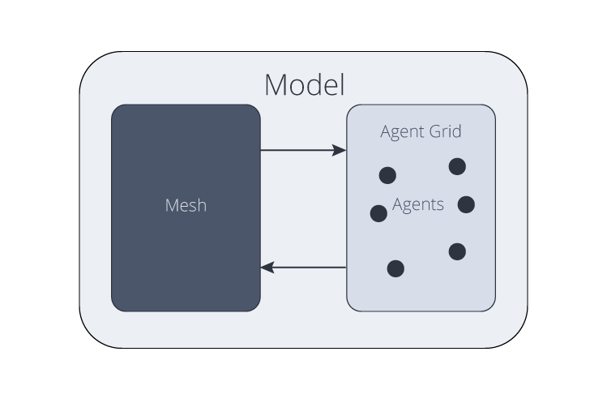

Structure of MyABM models
=========================

Models in :code:`myabm` contain three main components, the mesh, the environment, and the agents

The Model
---------
The :class:`~myabm.Model` is the top-level container and primary interface to all model components. 
It enables setup, execution, and post-processing (including static and dynamic visualization).

The Mesh
--------
The :class:`~mymesh.mesh` defines the geometry and connectivity of the model. 
A key benefit of MyABM is that models can be easily defined on arbitrary meshes, not just uniform grids. 

MyABM is built on `MyMesh <https://bu-smbl.github.io/mymesh/index.html>`_ 
which enables the construction of a wide variety of meshes, including 
`pre-defined meshes <https://bu-smbl.github.io/mymesh/generated/mymesh.primitives.html>`_ for uniform grids, spheres, and more, as well as 
`image-based <https://bu-smbl.github.io/mymesh/generated/mymesh.image.html>`_ 
or `implicitly defined <https://bu-smbl.github.io/mymesh/generated/mymesh.implicit.html>`_ meshes. 
Meshes can also easily be loaded from a variety of file types using 
:func:`mymesh.mesh.read`, facilitated by `meshio <https://github.com/nschloe/meshio>`_

The Environment
---------------
The environment describes the space agents operate within and is used to manage agents and other data associated with the model. 
It contains key :ref:`connectivity <Connectivity Information>` information from the mesh to enable agent migration, neighboring agent interactions, and more. 

Agents
------
:class:`~myabm.Agent`\ s can sense and perform actions within their environment.
This can include movement within the grid, interactions with or creation of other agents, etc.
